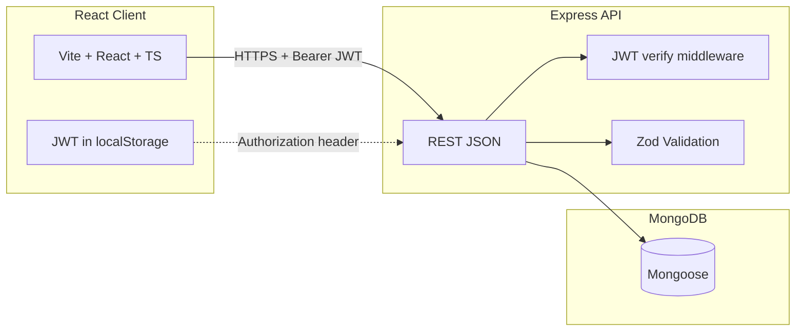

# FlowPilot

> **Workspace-first project delivery**

### Build faster with FlowPilot

One command center for **workspaces**, **projects**, and **tasks** — so your team always knows what ships next, who owns it, and how delivery is trending.

Behind the landing page: a full-stack app where teams organize work, assign ownership, track **status** and **priority**, and use **role-based access** (`OWNER` / `ADMIN` / `MEMBER`) enforced on the server.

**Repo layout:** **React (Vite)** frontend + **Express** API + **MongoDB** (Mongoose), monorepo-style (`client/` · `backend/`).

<p align="left">
  <a href="https://vitejs.dev/"></a>
  <a href="https://www.typescriptlang.org/"></a>
  <a href="https://www.mongodb.com/atlas/database"></a>
  <a href="https://render.com/"></a>
  <a href="https://vercel.com/"></a>
</p>

---

## Table of contents

- [Why FlowPilot](#why-flowpilot)
- [Architecture](#architecture)
- [Tech stack](#tech-stack)
- [Features (detailed)](#features-detailed)
- [Data model](#data-model)
- [Frontend structure & routes](#frontend-structure--routes)
- [Backend structure & API](#backend-structure--api)
- [Environment variables](#environment-variables)
- [Getting started](#getting-started)
- [Local development (recommended)](#local-development-recommended)
- [Database seeding](#database-seeding)
- [Authentication (JWT)](#authentication-jwt)
- [Security notes](#security-notes)
- [Deployment](#deployment)
- [Troubleshooting](#troubleshooting)
- [Scripts reference](#scripts-reference)

---

## Why FlowPilot

- **Single source of truth** for what the team is building: workspaces → projects → tasks.
- **Clear accountability** via assignees, due dates, and status columns.
- **Governance without friction**: permissions are explicit (`OWNER` / `ADMIN` / `MEMBER`) and checked on the server.
- **Modern UX**: responsive UI with light/dark theme, dashboards with analytics (including **overdue** counts), and a marketing **landing** page.

---

## Architecture



- The **browser** calls the API over HTTP(S). After login or register, the API returns a **JWT**; the client stores it (e.g. `localStorage`) and sends `Authorization: Bearer <token>` on protected routes.
- **CORS** allows only configured **origins** (see `FRONTEND_ORIGIN`). Multiple origins are supported as a **comma-separated** list (e.g. production URL + `http://localhost:5173`).
- **No session cookies** are required for API auth; `credentials` mode is off for simpler cross-origin behavior with JWT.

---

## Tech stack

| Layer | Technology |
|--------|------------|
| **UI** | React 18, TypeScript, Vite 6 |
| **Styling** | Tailwind CSS, Radix UI primitives, shadcn-style components, Lucide icons |
| **State & data** | TanStack Query, Zustand, React Router 7 |
| **Forms** | React Hook Form + Zod resolvers |
| **Tables / URL state** | TanStack Table, nuqs |
| **API client** | Axios (`VITE_API_BASE_URL` or same-origin `/api` via dev proxy) |
| **Server** | Express 4, TypeScript |
| **Database** | MongoDB with Mongoose 8 |
| **Auth** | Email/password + **JWT** (jsonwebtoken), bcrypt |
| **Validation** | Zod (controllers) |

---

## Features (detailed)

### Authentication

- **Register** — `POST /api/auth/register` creates user, default workspace, and member role; returns **`token`** + **`user`** (password never returned).
- **Login** — `POST /api/auth/login` verifies email/password; returns **`token`** + **`user`**.
- **Logout** — `POST /api/auth/logout` is a no-op on the server (client clears stored JWT).
- **Current user** — `GET /api/user/current` requires a valid **Bearer** token.
- The Axios client attaches the token from storage; **401** with a stale token clears storage and can redirect home (sign-in/sign-up and unauthenticated checks do not trigger a hard redirect loop).

### Workspaces

- Top-level **tenant** for a team: branding, settings, and membership.
- **CRUD** operations are permission-gated (e.g. only **OWNER** can delete a workspace).
- **Analytics** endpoints power dashboard cards (totals, **overdue** tasks, etc.).

### Members & invitations

- Users join a workspace as **members** with a **role** (`OWNER`, `ADMIN`, `MEMBER`).
- **Invite** flow via shareable URLs: **`/invite/workspace/:inviteCode/join`** (deep links require SPA hosting rewrites — see [Deployment](#deployment)).
- **Admins** can add members and remove members; **only OWNER** can change another member’s role.

### Projects

- **Projects** are scoped to a workspace and group related tasks.
- Create, update, delete according to **RBAC**.

### Tasks

- **Tasks** reference both a **project** and a **workspace**.
- **Status**: `BACKLOG`, `TODO`, `IN_PROGRESS`, `IN_REVIEW`, `DONE`.
- **Priority**: `LOW`, `MEDIUM`, `HIGH`, `URGENT`.
- **Assignment**: optional `assignedTo`; **dueDate** supports overdue logic in analytics.
- **taskCode**: auto-generated readable identifier.

### Role-based access control (RBAC)

Authoritative mapping: **`backend/src/utils/role-permission.ts`**.

| Role | Summary |
|------|---------|
| **OWNER** | Full workspace lifecycle; member management including **role changes**; full project & task CRUD; settings. |
| **ADMIN** | Add/remove members; workspace **settings**; full project & task CRUD. **Cannot** delete the workspace or change member roles. |
| **MEMBER** | **View**; **create** and **edit** tasks only — no task delete, no project/workspace admin. |

Permissions are stored on **Role** documents in MongoDB. After changing the TypeScript map, run **`npm run seed`** in `backend/`.

### Dashboard & landing

- **Workspace dashboard**: metrics and entry points into tasks and projects.
- **Project detail** views with task context.
- **Public landing**: marketing sections, sign-in / sign-up.

---

## Data model

| Entity | Purpose |
|--------|---------|
| **User** | Account (email, password hash, profile fields, current workspace pointer). |
| **Account** | Provider link for the user (e.g. email strategy uses `EMAIL` + email as `providerId`). |
| **Workspace** | Team container; owner reference. |
| **Member** | Join table: user ↔ workspace with **role**. |
| **Role** | Named role with **permission** strings (seeded from code). |
| **Project** | Belongs to workspace. |
| **Task** | Belongs to project + workspace; `assignedTo` / `createdBy` → User. |

Exact fields: `backend/src/models/`.

---

## Frontend structure & routes

| Route | Description |
|-------|-------------|
| `/` | Public landing |
| `/sign-in`, `/sign-up` | Email/password auth |
| `/invite/workspace/:inviteCode/join` | Accept workspace invite |
| `/workspace/:workspaceId` | Workspace dashboard |
| `/workspace/:workspaceId/tasks` | Tasks |
| `/workspace/:workspaceId/members` | Members |
| `/workspace/:workspaceId/settings` | Workspace settings |
| `/workspace/:workspaceId/project/:projectId` | Project detail |

Folders:

- `client/src/components/` — UI (layout, workspace, forms, `ui/`).
- `client/src/page/` — Route-level pages.
- `client/src/lib/` — API client, `auth-token.ts`, `base-url.ts`.
- `client/src/routes/` — Route config and guards.

---

## Backend structure & API

Routes are mounted under **`BASE_PATH`** (default **`/api`**).

| Mount path | Auth | Responsibility |
|------------|------|----------------|
| `/api/auth` | Public | Register, login, logout |
| `/api/user` | JWT required | Current user |
| `/api/workspace` | JWT required | Workspaces, analytics, settings |
| `/api/member` | JWT required | Members, invite join |
| `/api/project` | JWT required | Projects |
| `/api/task` | JWT required | Tasks |

Patterns:

- **`isAuthenticated`** — validates Bearer JWT, loads user, sets `req.user`.
- **`roleGuard`** — permission checks for sensitive actions.
- **Zod** — request validation; central **`errorHandler`** maps errors to HTTP responses.

---

## Environment variables

Never commit real **`.env`** files. Use **`backend/.env.example`** and **`client/.env.example`**.

### Backend (`backend/.env`)

| Variable | Required | Description |
|----------|----------|-------------|
| `PORT` | Optional | Server port (default `5000` in code if unset). |
| `NODE_ENV` | Recommended | `development` or `production`. |
| `BASE_PATH` | Optional | API prefix (default `/api`). |
| `MONGO_URI` | **Yes** | MongoDB connection string. |
| `JWT_SECRET` | **Yes** | Secret for signing access tokens (long random string in production). |
| `JWT_EXPIRES_IN` | Optional | `jsonwebtoken` expiry (default `7d` in app config). |
| `FRONTEND_ORIGIN` | **Yes** | Allowed browser origin(s) for **CORS**. **Comma-separated** for multiple values, e.g. `https://your-app.vercel.app,http://localhost:5173`. |

### Frontend (`client/.env`)

| Variable | Description |
|----------|-------------|
| `VITE_API_BASE_URL` | **Production / direct API:** full URL ending in `/api`, e.g. `https://your-api.onrender.com/api`. **Local dev with proxy:** use `/api` (see [Local development](#local-development-recommended)). |
| `VITE_DEV_PROXY_TARGET` | Optional. Dev only. Backend URL for Vite proxy (default `http://127.0.0.1:8000`). |

**Vercel / CI:** set `VITE_API_BASE_URL` at **build** time; Vite inlines it into the bundle.

---

## Getting started

### Prerequisites

- **Node.js** (LTS)
- **MongoDB** (local or [Atlas](https://www.mongodb.com/cloud/atlas))

### 1. Clone and install

```bash
git clone <your-repo-url>
cd Task_Managemet
cd backend && npm install && cd ..
cd client && npm install && cd ..
```

### 2. Configure environment

```bash
cp backend/.env.example backend/.env
cp client/.env.example client/.env
```

- **Backend:** set `MONGO_URI`, `JWT_SECRET`, and `FRONTEND_ORIGIN` (include your Vite URL when testing from the browser against a local API).
- **Client:** for the smoothest local experience, rely on **`client/.env.development`** (already in repo) which sets `VITE_API_BASE_URL=/api` and uses the Vite proxy.

### 3. Seed roles

```bash
cd backend && npm run seed && cd ..
```

### 4. Run (two terminals)

**Terminal A — API**

```bash
cd backend
npm run dev
```

**Terminal B — Client**

```bash
cd client
npm run dev
```

Open the URL Vite prints (usually `http://localhost:5173`).

### 5. Production build (frontend)

```bash
cd client
npm run build
npm run preview   # optional: test dist locally
```

---

## Local development (recommended)

- **`client/.env.development`** sets `VITE_API_BASE_URL=/api`.
- **`client/vite.config.ts`** proxies **`/api`** → **`http://127.0.0.1:8000`** (override with `VITE_DEV_PROXY_TARGET`).
- The browser only talks to the Vite origin, so you avoid **CORS** issues while developing.
- Ensure the **backend** is running on the proxied port (default **8000** matches a typical `backend/.env`).

To call a **remote** API from local Vite instead, set in `.env.development` or `.env.local`:

`VITE_API_BASE_URL=https://your-deployed-api.example.com/api`

and add your dev origin to the backend’s **`FRONTEND_ORIGIN`** list on the server.

---

## Database seeding

```bash
cd backend
npm run seed
```

Run after changing **`backend/src/utils/role-permission.ts`** so MongoDB roles stay aligned.

---

## Authentication (JWT)

1. **Register** — client `POST /api/auth/register` → stores **`token`**, navigates (e.g. to workspace).
2. **Login** — `POST /api/auth/login` → same.
3. **Protected calls** — Axios reads the token from storage and sets **`Authorization: Bearer …`**.
4. **Expiry / invalid token** — API returns **401**; client may clear token and send the user home; sign-in page does not prefetch `/user/current` in a way that causes redirect loops.

---

## Security notes

- Use **HTTPS** in production for the API and the SPA.
- **`JWT_SECRET`**: long, random, stored as a secret; rotate if compromised.
- **CORS**: keep **`FRONTEND_ORIGIN`** to real front-end origins only (comma-separated list is fine).
- **MongoDB**: credentials in env / secret manager, not in git.
- **JWT in `localStorage`**: standard tradeoff for SPAs; mitigate with HTTPS, short-ish `JWT_EXPIRES_IN`, and XSS hygiene.

---

## Deployment

| Component | Typical approach |
|-----------|------------------|
| **Frontend** | **Vercel** — project **Root Directory** = `client`; set **`VITE_API_BASE_URL`** for Production (and Preview if needed); build outputs `dist/`. |
| **Backend** | **Render**, Railway, Fly.io, VPS — run `npm run build` then `npm start` in `backend/`. |
| **Database** | MongoDB Atlas or self-hosted MongoDB. |

### Frontend (Vercel) checklist

- [ ] **Root Directory:** `client` (if the repo contains both `client` and `backend`).
- [ ] **Environment variable:** `VITE_API_BASE_URL=https://YOUR-API-HOST/api` — set for **Production** (and **Preview** if you use preview URLs).
- [ ] **Redeploy** after changing env vars (Vite bakes them at build time).
- [ ] **`client/vercel.json`** — SPA **rewrites** all paths to `index.html` so deep links like **`/invite/workspace/…/join`** work when opened directly or refreshed.

### Backend checklist

- [ ] `MONGO_URI`, `JWT_SECRET`, `JWT_EXPIRES_IN` (optional).
- [ ] `FRONTEND_ORIGIN` includes every browser origin that calls the API (production URL, `http://localhost:5173` for local-to-remote tests, optional `*.vercel.app` handling is implemented in code for previews — still verify in your environment).
- [ ] `NODE_ENV=production`
- [ ] HTTPS for the public API URL

---

## Troubleshooting

| Issue | What to check |
|-------|----------------|
| **CORS / “Network Error”** | `FRONTEND_ORIGIN` must include the **exact** browser origin (scheme + host + port). Use commas for multiple origins. |
| **Vercel 404 on refresh / invite link** | Ensure **`client/vercel.json`** is deployed and trigger a new deployment. |
| **`VITE_API_BASE_URL` missing in production** | Set in Vercel env and **redeploy**; empty value breaks API calls. |
| **Local: API unreachable** | Backend running? Port matches **`VITE_DEV_PROXY_TARGET`**? Try `VITE_API_BASE_URL=/api` with the Vite proxy. |
| **401 after login** | Wrong `JWT_SECRET` between deploys, expired token, or user inactive. |
| **Sign-in page bounces to `/`** | Fixed in current client: unauthenticated `/user/current` should not hard-redirect; use latest client code. |
| **Permission errors** | Run **`npm run seed`**; confirm the member’s **role** in the workspace. |

---

## Scripts reference

| Location | Command | Purpose |
|----------|---------|---------|
| `client` | `npm run dev` | Vite dev server (uses `.env.development` + proxy when configured). |
| `client` | `npm run build` | Typecheck + production bundle |
| `client` | `npm run lint` | ESLint |
| `client` | `npm run preview` | Serve `dist` locally |
| `backend` | `npm run dev` | API with `ts-node-dev` |
| `backend` | `npm run seed` | Seed roles |
| `backend` | `npm run build` | Compile TypeScript to `dist/` |
| `backend` | `npm start` | `node dist/index.js` |

---

## Acknowledgements

**FlowPilot** — structured delivery: workspaces, projects, tasks, and roles in one place.
