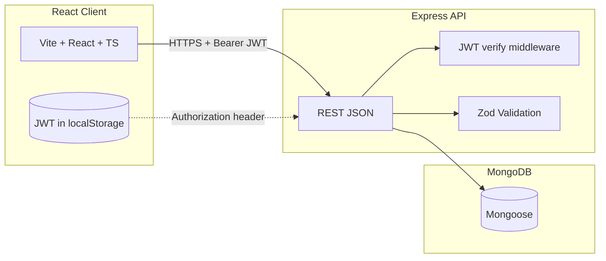
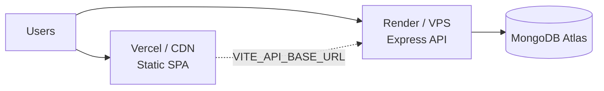
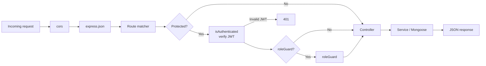
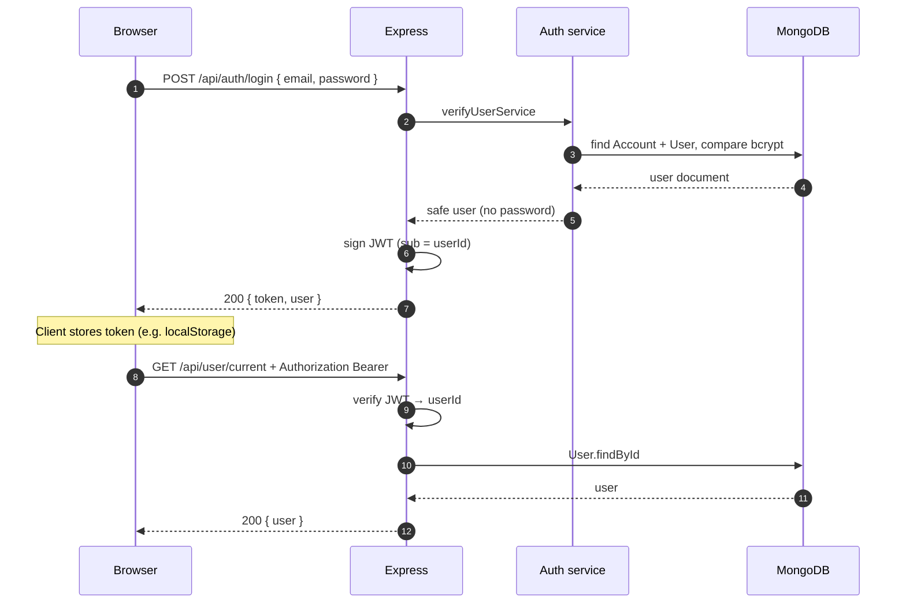
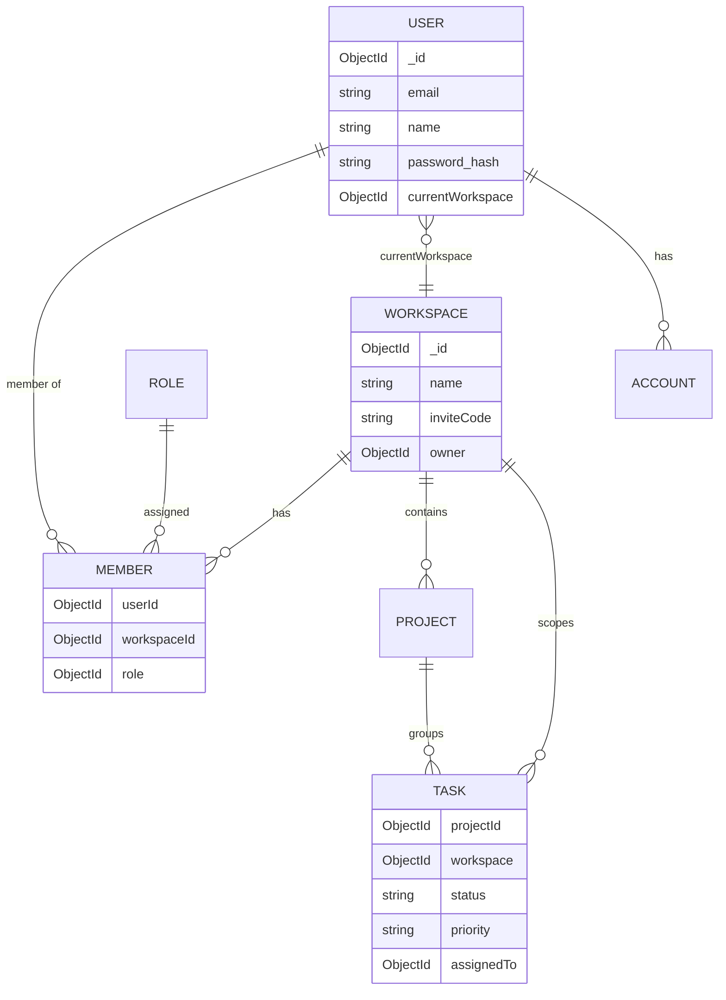
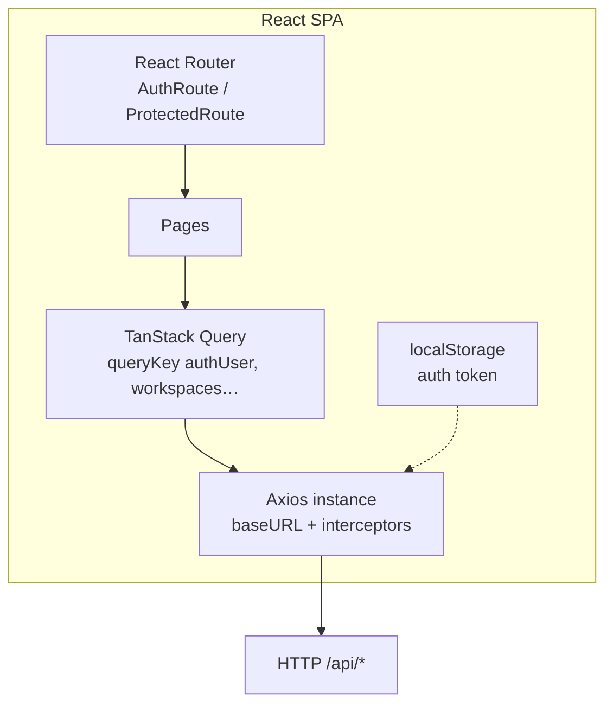

<div align="center">

# FlowPilot


<br/>

[](https://vitejs.dev/)
[](https://react.dev/)
[](https://www.typescriptlang.org/)
[](https://expressjs.com/)
[](https://www.mongodb.com/)
[](LICENSE)


<br/>

**[Features](#features)** · **[Architecture](#architecture)** · **[Quick start](#quick-start)** · **[Environment](#environment-variables)** · **[API](#api-overview)** · **[Deploy](#deployment)**

</div>

---

## Table of contents

1. [Overview](#overview)
2. [Features](#features)
3. [Project structure](#project-structure)
4. [Architecture](#architecture)
   - [System context](#system-context)
   - [Containers and deployment view](#containers-and-deployment-view)
   - [Backend request pipeline](#backend-request-pipeline)
   - [Authentication sequence (JWT)](#authentication-sequence-jwt)
   - [Domain model (ER-style)](#domain-model-data-layer)
   - [Frontend architecture](#frontend-architecture)
5. [Quick start](#quick-start)
6. [Local development (Vite proxy)](#local-development-vite-proxy)
7. [Frontend routes](#frontend-routes)
8. [API overview](#api-overview)
9. [RBAC reference](#rbac-role-based-access-control)
10. [Environment variables](#environment-variables)
11. [JWT authentication recap](#jwt-authentication-recap)
12. [Deployment](#deployment)
13. [Troubleshooting](#troubleshooting)
14. [Scripts](#scripts)
15. [Security notes](#security-notes)
16. [License](#license)

---

## Overview

**FlowPilot** is a **full-stack** monorepo for teams that want a single place to manage **workspaces**, **projects**, and **tasks** with **role-based access control** enforced on the server.

| Layer | Location | Stack |
|--------|-----------|--------|
| **SPA** | `client/` | React 18, Vite 6, TypeScript, Tailwind CSS, Radix UI, TanStack Query, React Router 7, Axios |
| **API** | `backend/` | Express 4, TypeScript, `jsonwebtoken`, bcrypt, Zod, Mongoose 8 |
| **Data** | MongoDB | Documents for users, workspaces, members, roles, projects, tasks |

**Product flow:** a new user **registers** → API creates **User**, **Account** (email provider), default **Workspace**, **Member** row with **OWNER** **Role**, and sets `user.currentWorkspace`. Subsequent API calls carry a **JWT** until logout or expiry.

---

## Features

| Area | What you get |
|------|----------------|
| **Auth** | Email/password **register** & **login**; API returns **JWT** + user; client stores token and sends `Authorization: Bearer …` |
| **Workspaces** | CRUD (per permissions), settings, **analytics** (counts, overdue tasks) |
| **Projects** | Workspace-scoped projects; create / update / delete with RBAC |
| **Tasks** | Status, priority, assignee, due date, filters, tables, auto **taskCode** |
| **Members** | Invite via **`/invite/workspace/:inviteCode/join`**; join API for logged-in users |
| **RBAC** | `OWNER` · `ADMIN` · `MEMBER` — permissions in code + seeded **Role** documents |
| **UX** | Light/dark theme, responsive layout, marketing **landing**, toasts, polished invite screen |

---

## Project structure

```
Task_Managemet/
├── client/
│   ├── public/                 # Static assets (e.g. logo)
│   ├── src/
│   │   ├── components/         # UI primitives, workspace UI, forms, ui/ (shadcn-style)
│   │   ├── page/               # Route-level screens (auth, workspace, landing, invite)
│   │   ├── routes/             # BrowserRouter, AuthRoute, ProtectedRoute, path maps
│   │   ├── lib/                # axios-client, auth-token, base-url, api.ts mutations/queries
│   │   ├── hooks/              # useAuth, workspace queries, etc.
│   │   ├── context/            # AuthProvider (user + workspace context)
│   │   ├── types/, constant/
│   │   └── main.tsx, App.tsx
│   ├── .env.development        # Dev: VITE_API_BASE_URL=/api + proxy
│   ├── vercel.json             # SPA fallback → index.html (deep links on Vercel)
│   ├── vite.config.ts          # Proxy /api → backend
│   └── package.json
│
├── backend/
│   ├── src/
│   │   ├── config/             # app.config (env), database
│   │   ├── controllers/        # Thin HTTP handlers
│   │   ├── middlewares/        # isAuthenticated (JWT), errorHandler, asyncHandler, roleGuard
│   │   ├── models/             # Mongoose schemas (User, Workspace, Task, …)
│   │   ├── routes/             # Mount routers under BASE_PATH
│   │   ├── services/           # Business logic & transactions
│   │   ├── validation/         # Zod schemas
│   │   ├── utils/              # jwt, bcrypt helpers, AppError
│   │   ├── enums/
│   │   ├── seeders/
│   │   └── index.ts            # Express app entry
│   ├── dist/                   # tsc output (production)
│   └── .env.example
│
└── README.md
```

---

## Architecture

This section describes **how pieces connect**, **how a request flows**, and **how auth works** end-to-end.

### System context

High-level stack: **React client** → **Express API** (`REST JSON` entry) → **MongoDB** via **Mongoose**. JWT lives in the browser; protected calls send the **Bearer** token.



- **Authentication flow:** The **browser** calls the API over HTTP(S). After **login** or **register**, the API returns a **JWT**; the client stores it (e.g. `localStorage`) and sends `Authorization: Bearer <token>` on protected routes.
- **CORS:** **CORS** allows only configured **origins** (see `FRONTEND_ORIGIN`). Multiple origins are supported as a **comma-separated** list (e.g. production URL + `http://localhost:5173`). Preview hosts like `*.vercel.app` and local dev URLs are also handled in API code where configured.
- **Sessions:** **No session cookies** are required for API auth; **`credentials`** mode is **off** on the client for simpler cross-origin behavior with JWT.

The **SPA** never talks to **MongoDB** directly — all persistence goes through **REST** under `BASE_PATH` (default `/api`).

### Containers and deployment view

Typical production split (you can swap hosts freely):



| Container | Responsibility |
|-----------|----------------|
| **Static host** | Serves `client/dist`, **rewrites** unknown paths to `index.html` so React Router works on refresh. |
| **API host** | Runs `node dist/index.js`, holds secrets (`JWT_SECRET`, `MONGO_URI`). |
| **MongoDB** | Source of truth for users, workspaces, tasks, roles. |

### Backend request pipeline

Every HTTP request passes through a **pipeline**:



**Logical layers** (not separate npm packages, but clear separation in `backend/src/`):

| Layer | Folder(s) | Role |
|--------|-----------|------|
| **Transport** | `routes/`, `index.ts` | HTTP paths, method, mount `BASE_PATH` |
| **Application** | `controllers/`, `validation/` | Parse body/params with Zod, call services, map to status codes |
| **Domain / use cases** | `services/` | Transactions, rules (e.g. “only OWNER deletes workspace”) |
| **Infrastructure** | `models/`, `config/` | Mongoose, env, DB connection |
| **Cross-cutting** | `middlewares/`, `utils/appError.ts` | Auth, errors, async wrapper |

**Error handling:** thrown `AppError` subclasses and Zod errors are normalized by **`errorHandler`** middleware into consistent JSON `{ message, errorCode? }`.

### Authentication sequence (JWT)

**Login** (same idea for **register**, which also returns a token):



**Token invalid / expired:** API responds **401**; client may clear storage and send the user to the landing or sign-in page. Sign-in and sign-up routes **do not** prefetch `/user/current` for guests, avoiding redirect loops.

### Domain model (data layer)

Simplified entity relationships (Mongoose `ref` where used):



Exact fields: see `backend/src/models/*.ts`.

### Frontend architecture



| Concern | Implementation |
|---------|----------------|
| **Routing** | `AuthRoute` — if logged in, redirect to workspace; else show marketing + auth pages. `ProtectedRoute` — requires user from `useAuth`. |
| **Server state** | TanStack Query: `useAuth`, workspace/project/task queries, mutations with `queryClient` invalidation. |
| **API base URL** | `normalizeApiBase`: production full URL with `/api`; dev often **`/api`** + Vite **proxy** to Express. |
| **Auth header** | Request interceptor reads token from **`auth-token.ts`** helpers. |

<details>
<summary><strong>Expand: Dev vs prod networking</strong></summary>

| Mode | Browser calls | CORS |
|------|---------------|------|
| **Dev (recommended)** | `http://localhost:5173/api/...` → Vite proxies to `127.0.0.1:8000` | Same origin to Vite → no browser CORS for API |
| **Prod** | `https://your-spa.com` loads JS that calls `https://api.example.com/api/...` | API must allow SPA origin via `FRONTEND_ORIGIN` |

</details>

---

## Quick start

### Prerequisites

- [Node.js](https://nodejs.org/) LTS  
- [MongoDB](https://www.mongodb.com/cloud/atlas) URI  

### Install

```bash
git clone <your-repo-url>
cd Task_Managemet

cd backend && npm install && cd ..
cd client && npm install && cd ..
```

### Configure

```bash
cp backend/.env.example backend/.env
# Set MONGO_URI, JWT_SECRET, FRONTEND_ORIGIN (see Environment section)
```

`client/.env.development` is tuned for **local proxy** (`VITE_API_BASE_URL=/api`).

### Seed roles (once per database)

```bash
cd backend && npm run seed && cd ..
```

### Run

**Terminal A — API**

```bash
cd backend && npm run dev
```

**Terminal B — Client**

```bash
cd client && npm run dev
```

Open **http://localhost:5173**, register, then open your workspace from the dashboard.

---

## Local development (Vite proxy)

- **`client/.env.development`**: `VITE_API_BASE_URL=/api`  
- **`vite.config.ts`**: proxies `/api` → `http://127.0.0.1:8000` (override with `VITE_DEV_PROXY_TARGET`)

The browser only sees the Vite origin; API calls are forwarded server-side, avoiding CORS during local development.

---

## Frontend routes

| Path | Screen |
|------|--------|
| `/` | Landing |
| `/sign-in`, `/sign-up` | Auth |
| `/invite/workspace/:inviteCode/join` | Invite accept |
| `/workspace/:workspaceId` | Dashboard |
| `/workspace/:workspaceId/tasks` | Tasks |
| `/workspace/:workspaceId/members` | Members |
| `/workspace/:workspaceId/settings` | Settings |
| `/workspace/:workspaceId/project/:projectId` | Project detail |

---

## API overview

Mounted under **`BASE_PATH`** (default **`/api`**).

| Method / prefix | Auth | Purpose |
|-----------------|------|---------|
| `POST /auth/register` | Public | User + workspace + token |
| `POST /auth/login` | Public | Token + user |
| `POST /auth/logout` | Public | Client-side logout |
| `GET /user/current` | JWT | Profile |
| `/workspace/*` | JWT | Workspaces & analytics |
| `/member/*` | JWT | Members & invite join |
| `/project/*`, `/task/*` | JWT | Projects & tasks |

---

## RBAC (role-based access control)

Authoritative permission map: **`backend/src/utils/role-permission.ts`**. Run **`npm run seed`** after changing it.

| Role | Capabilities (summary) |
|------|-------------------------|
| **OWNER** | Full workspace lifecycle; **change member roles**; delete workspace; full project & task CRUD |
| **ADMIN** | Members add/remove; workspace settings; full project & task CRUD — **no** workspace delete, **no** role changes |
| **MEMBER** | View; create/edit **tasks** only — stricter limits on projects/settings |

<details>
<summary><strong>Expand: permission philosophy</strong></summary>

- UI may hide buttons, but **every sensitive route** should rely on **`roleGuard`** or service-level checks so direct API calls cannot bypass rules.
- **Role** documents in MongoDB store string permissions aligned with the TypeScript map; seeding keeps DB and code in sync.

</details>

---

## Environment variables

### Backend (`backend/.env`)

| Variable | Description |
|----------|-------------|
| `PORT` | Listen port (e.g. `8000`) |
| `NODE_ENV` | `development` or `production` |
| `BASE_PATH` | API prefix; default `/api` |
| `MONGO_URI` | MongoDB connection string |
| `JWT_SECRET` | Secret for signing JWTs (use a long random value in prod) |
| `JWT_EXPIRES_IN` | Optional; e.g. `7d` |
| `FRONTEND_ORIGIN` | CORS allowlist — **comma-separated** origins |

Template: **`backend/.env.example`**.

### Frontend (build / dev)

| Variable | Description |
|----------|-------------|
| `VITE_API_BASE_URL` | Production: `https://api-host/api`. Dev with proxy: `/api` |
| `VITE_DEV_PROXY_TARGET` | Dev: backend URL for proxy (default `http://127.0.0.1:8000`) |

See **`client/.env.example`** and **`client/.env.development`**.

---

## JWT authentication recap

1. **Register** or **login** → `{ token, user }`.  
2. Client persists **token**; Axios sends **`Authorization: Bearer …`**.  
3. **Protected** routes: middleware validates JWT, loads **User**, sets **`req.user`**.  
4. **401**: client clears bad token; guest routes avoid unnecessary `/user/current` calls.

---

## Deployment

### Frontend (e.g. Vercel)

1. **Root Directory:** `client` (monorepo).  
2. **Environment:** `VITE_API_BASE_URL=https://YOUR-API/api` for Production (+ Preview if needed).  
3. **`client/vercel.json`:** rewrites all routes to **`index.html`** for SPA deep links.  
4. **Redeploy** after env changes (Vite embeds vars at build time).

### Backend (e.g. Render)

1. Build: `npm run build`; Start: `npm start`.  
2. Set `MONGO_URI`, `JWT_SECRET`, `NODE_ENV=production`, `FRONTEND_ORIGIN`.

### Checklist

- [ ] HTTPS everywhere in production  
- [ ] `FRONTEND_ORIGIN` lists every real browser origin  
- [ ] `VITE_API_BASE_URL` ends with `/api` and matches deployed API  
- [ ] MongoDB reachable from API host  

---

## Troubleshooting

| Symptom | Likely fix |
|---------|------------|
| CORS / network errors | Match `FRONTEND_ORIGIN` to exact origin; comma-separate multiple. |
| Vercel 404 on refresh / invite URL | Ensure `vercel.json` is deployed. |
| Wrong API host in production | Set `VITE_API_BASE_URL` on host + **rebuild**. |
| Local API not hit | Run backend; check proxy port / `VITE_DEV_PROXY_TARGET`. |
| Permission / role errors | `npm run seed`; check **Member** role in DB. |

---

## Scripts

| Where | Command | Purpose |
|-------|---------|---------|
| `client` | `npm run dev` | Vite dev server |
| `client` | `npm run build` | Typecheck + bundle |
| `client` | `npm run preview` | Preview `dist` |
| `client` | `npm run lint` | ESLint |
| `backend` | `npm run dev` | API + watch |
| `backend` | `npm run build` | `tsc` → `dist/` |
| `backend` | `npm start` | `node dist/index.js` |
| `backend` | `npm run seed` | Seed roles |

---

## Security notes

- Strong **`JWT_SECRET`**, **HTTPS**, secrets only in env — never in git.  
- JWT in **localStorage** is standard for SPAs; mitigate **XSS** (dependencies, CSP where possible).  
- Rate limiting / refresh tokens are **not** included out of the box — consider for high-risk deployments.

---

## License

This project is licensed under the **[MIT License](LICENSE)**.


---

<div align="center">

<br/>


<br/>

**FlowPilot** — workspaces, projects, tasks, one stack.

</div>
