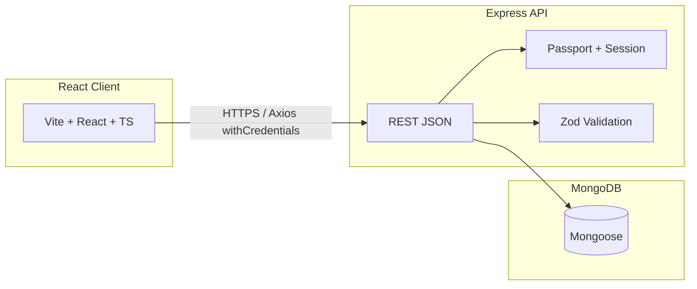

# FlowPilot

> **Workspace-first project delivery**

### Build faster with FlowPilot

One command center for **workspaces**, **projects**, and **tasks** — so your team always knows what ships next, who owns it, and how delivery is trending.

Behind the landing page: a full-stack app where teams organize work, assign ownership, track **status** and **priority**, and use **role-based access** (`OWNER` / `ADMIN` / `MEMBER`) enforced on the server.

**Repo layout:** **React (Vite)** frontend + **Express** API + **MongoDB** (Mongoose), monorepo-style (`client/` · `backend/`).

<p align="left">
  <a href="https://vitejs.dev/"></a>
  <a href="https://www.typescriptlang.org/"></a>
  <a href="https://www.mongodb.com/atlas/database"></a>
  <a href="https://render.com/"></a>
  <a href="https://vercel.com/"></a>
</p>

---

## Table of contents

- [Why FlowPilot](#why-flowpilot)
- [Architecture](#architecture)
- [Tech stack](#tech-stack)
- [Features (detailed)](#features-detailed)
- [Data model](#data-model)
- [Frontend structure & routes](#frontend-structure--routes)
- [Backend structure & API](#backend-structure--api)
- [Environment variables](#environment-variables)
- [Getting started](#getting-started)
- [Database seeding](#database-seeding)
- [Authentication flows](#authentication-flows)
- [Security notes](#security-notes)
- [Deployment](#deployment)
- [Troubleshooting](#troubleshooting)
- [Scripts reference](#scripts-reference)
- [License](#license)

---

## Why FlowPilot

- **Single source of truth** for what the team is building: workspaces → projects → tasks.
- **Clear accountability** via assignees, due dates, and status columns.
- **Governance without friction**: permissions are explicit (`OWNER` / `ADMIN` / `MEMBER`) and checked on the server.
- **Modern UX**: responsive UI with light/dark theme, dashboards with analytics (including **overdue** counts), and a marketing **landing** page.

---

## Architecture



- The **browser** talks to the API over HTTP(S). **Session cookies** identify the user after login (`withCredentials: true` in Axios).
- **CORS** is restricted to `FRONTEND_ORIGIN` so only your web app can use cookies in the browser.
- **Google OAuth** is handled by Passport; the API redirects back to the frontend on success or failure.

---

## Tech stack

| Layer | Technology |
|--------|------------|
| **UI** | React 18, TypeScript, Vite 6 |
| **Styling** | Tailwind CSS, Radix UI primitives, shadcn-style components, Lucide icons |
| **State & data** | TanStack Query, Zustand, React Router 7 |
| **Forms** | React Hook Form + Zod resolvers |
| **Tables / URL state** | TanStack Table, nuqs |
| **API client** | Axios (base URL from `VITE_API_BASE_URL`) |
| **Server** | Express 4, TypeScript |
| **Database** | MongoDB with Mongoose 8 |
| **Auth** | Passport (local + Google OAuth 20), bcrypt, cookie-session |
| **Validation** | Zod (shared pattern on controllers) |

---

## Features (detailed)

### Authentication & sessions

- **Register** with email and password (`POST /api/auth/register`); passwords are hashed (**bcrypt**) before storage.
- **Login** with Passport **local** strategy (`POST /api/auth/login`); on success the API establishes a **session**.
- **Logout** (`POST /api/auth/logout`) clears the session.
- **Google sign-in**: user is sent to `GET /api/auth/google`; Google redirects to `GET /api/auth/google/callback`; on success the API redirects to **`FRONTEND_ORIGIN/workspace/<workspaceId>`**; on failure to **`FRONTEND_GOOGLE_CALLBACK_URL?status=failure`** (this should be your React route that shows the failure UI, e.g. `/google/oauth/callback`).
- The **Axios** client sends cookies on every request (`withCredentials: true`). A **401** with message `"Unauthorized"` redirects the user to the landing page.

### Workspaces

- Top-level **tenant** for a team: branding, settings, and membership.
- **CRUD** operations are permission-gated (e.g. only **OWNER** can delete a workspace).
- **Analytics** endpoints power dashboard cards (totals, **overdue** tasks, etc.).

### Members & invitations

- Users join a workspace as **members** with a **role** (`OWNER`, `ADMIN`, `MEMBER`).
- **Invite** flow via shareable invite URLs (see client route `/invite/workspace/:inviteCode/join`).
- **Admins** can add members and (per current rules) remove members; **only OWNER** can change another member’s role.

### Projects

- **Projects** are scoped to a workspace and group related tasks.
- Create, update, delete according to **RBAC** (owners and admins typically have full project CRUD).

### Tasks

- **Tasks** reference both a **project** and a **workspace** for consistent scoping and queries.
- **Status**: `BACKLOG`, `TODO`, `IN_PROGRESS`, `IN_REVIEW`, `DONE`.
- **Priority**: `LOW`, `MEDIUM`, `HIGH`, `URGENT`.
- **Assignment**: optional `assignedTo` (user id); **dueDate** supports overdue logic in analytics.
- **taskCode**: auto-generated readable identifier.
- UI includes **tables**, **filters**, **recent tasks**, and **create/edit** forms aligned with backend enums.

### Role-based access control (RBAC)

Authoritative mapping: **`backend/src/utils/role-permission.ts`**.

| Role | Summary |
|------|---------|
| **OWNER** | Full workspace lifecycle; member management including **role changes**; full project & task CRUD; settings. |
| **ADMIN** | Add/remove members; workspace **settings**; full project & task CRUD. **Cannot** delete the workspace or change member roles. |
| **MEMBER** | **View**; **create** and **edit** tasks only — no task delete, no project/workspace admin. |

Permissions are also stored on **Role** documents in MongoDB. After changing the TypeScript map, run **`npm run seed`** so the database stays aligned.

### Dashboard & landing

- **Workspace dashboard**: high-level metrics and entry points into tasks and projects.
- **Project detail** views with task context.
- **Public landing**: marketing sections (features, how it works, testimonials, FAQ), GitHub link, sign-in / sign-up.

---

## Data model

High-level relationships (Mongoose `ref` where applicable):

| Entity | Purpose |
|--------|---------|
| **User** | Account (email, password hash, profile fields, current workspace pointer). |
| **Account** | Linked OAuth provider (e.g. Google) tied to a user. |
| **Workspace** | Team container; owner reference. |
| **Member** | Join table: user ↔ workspace with **role**. |
| **Role** | Named role with array of **permission** strings (seeded from code). |
| **Project** | Belongs to workspace. |
| **Task** | Belongs to project + workspace; assignedTo → User; createdBy → User. |

Exact fields live under `backend/src/models/`.

---

## Frontend structure & routes

| Route | Description |
|-------|-------------|
| `/` | Public landing |
| `/sign-in`, `/sign-up` | Authentication |
| `/google/oauth/callback` | Google OAuth **failure** UI (query `status=failure`) |
| `/invite/workspace/:inviteCode/join` | Accept workspace invite |
| `/workspace/:workspaceId` | Workspace dashboard |
| `/workspace/:workspaceId/tasks` | Tasks |
| `/workspace/:workspaceId/members` | Members |
| `/workspace/:workspaceId/settings` | Workspace settings |
| `/workspace/:workspaceId/project/:projectId` | Project detail |

Key folders:

- `client/src/components/` — UI building blocks (layout, workspace, forms, shadcn-style `ui/`).
- `client/src/page/` — Route-level pages.
- `client/src/lib/` — API client (`axios-client.ts`), utilities.
- `client/src/routes/` — Route configuration and guards.

---

## Backend structure & API

Routes are mounted under **`BASE_PATH`** (default **`/api`**).

| Mount path | Auth | Responsibility |
|------------|------|------------------|
| `/api/auth` | Public (except session for callback) | Register, login, logout, Google OAuth |
| `/api/user` | Session required | Current user profile / preferences |
| `/api/workspace` | Session required | Workspaces, analytics, settings |
| `/api/member` | Session required | Members, invites |
| `/api/project` | Session required | Projects |
| `/api/task` | Session required | Tasks |

Implementation patterns:

- **`isAuthenticated`** middleware protects private routers.
- **`roleGuard`** checks permission arrays for destructive or sensitive actions.
- **Zod** parses `req.body` / params in controllers; invalid input returns structured errors.
- **Central `errorHandler`** maps exceptions to HTTP responses.

---

## Environment variables

Never commit real `.env` files. Use **`backend/.env.example`** and **`client/.env.example`** as templates.

### Backend (`backend/.env`)

| Variable | Required | Description |
|----------|----------|-------------|
| `PORT` | Optional | Server port (default `5000` in code if unset — set explicitly to avoid surprises). |
| `NODE_ENV` | Recommended | `development` or `production` (affects **secure** session cookies). |
| `BASE_PATH` | Optional | API prefix (default `/api`). |
| `MONGO_URI` | **Yes** | MongoDB connection string. |
| `SESSION_SECRET` | **Yes** | Secret key(s) for signing session cookies (use a long random value in production). |
| `SESSION_EXPIRES_IN` | **Yes** | Required by env loader. Note: cookie **`maxAge`** is still **fixed at 24h** in `backend/src/index.ts` unless you connect it to this value. |
| `GOOGLE_CLIENT_ID` | **Yes*** | Google OAuth client ID. |
| `GOOGLE_CLIENT_SECRET` | **Yes*** | Google OAuth secret. |
| `GOOGLE_CALLBACK_URL` | **Yes** | Must match Google Console **Authorized redirect URI** (e.g. `http://localhost:8000/api/auth/google/callback`). |
| `FRONTEND_ORIGIN` | **Yes** | Exact origin of the React app for **CORS** (e.g. `http://localhost:5173`). |
| `FRONTEND_GOOGLE_CALLBACK_URL` | **Yes** | Full URL for **failed** Google login redirect (e.g. `http://localhost:5173/google/oauth/callback`). |

\*The current `getEnv` helper throws if variables are missing — for local work without Google you may need placeholder values or a small code change to make OAuth optional.

### Frontend (`client/.env`)

| Variable | Description |
|----------|-------------|
| `VITE_API_BASE_URL` | API base URL including `/api` if the server uses `BASE_PATH=/api` (e.g. `http://localhost:8000/api`). |

**Production:** set `VITE_API_BASE_URL` at build time to your public API URL.

---

## Getting started

### Prerequisites

- **Node.js** (LTS recommended)
- **MongoDB** (local or [Atlas](https://www.mongodb.com/cloud/atlas))
- Optional: **Google Cloud** OAuth client

### 1. Clone and install

```bash
git clone <your-repo-url>
cd Task_Managemet
```

Install **backend** and **client** separately:

```bash
cd backend && npm install && cd ..
cd client && npm install && cd ..
```

### 2. Configure environment

```bash
cp backend/.env.example backend/.env
cp client/.env.example client/.env
```

Edit both files: set `MONGO_URI`, `SESSION_SECRET`, origins, and Google keys if used. Ensure **`FRONTEND_ORIGIN`** matches the URL where Vite runs.

### 3. Seed roles

```bash
cd backend
npm run seed
```

### 4. Run

**Terminal A — API**

```bash
cd backend
npm run dev
```

**Terminal B — Client**

```bash
cd client
npm run dev
```

Open the URL Vite prints (commonly `http://localhost:5173`).

### 5. Production build (frontend only)

```bash
cd client
npm run build
npm run preview   # optional local test of dist/
```

---

## Database seeding

The **Role** collection stores permission arrays that should mirror `RolePermissions` in TypeScript.

```bash
cd backend
npm run seed
```

Run whenever you change **`backend/src/utils/role-permission.ts`** so new or updated roles are reflected for existing databases.

---

## Authentication flows

### Email / password

1. Client `POST /api/auth/register` then user signs in via `POST /api/auth/login`.
2. Session cookie is set; subsequent requests include it automatically with `withCredentials`.

### Google

1. User clicks Google button → browser navigates to `GET {VITE_API_BASE_URL}/auth/google` (i.e. `/api/auth/google`).
2. Google redirects to **`GOOGLE_CALLBACK_URL`** on your API.
3. On success, API redirects to **`{FRONTEND_ORIGIN}/workspace/{currentWorkspaceId}`**.
4. On failure, API redirects to **`FRONTEND_GOOGLE_CALLBACK_URL?status=failure`** — should load **`/google/oauth/callback`** in the React app.

---

## Security notes

- Use **HTTPS** in production so `secure` session cookies work.
- Keep **`SESSION_SECRET`** long and random; rotate if leaked.
- Restrict **CORS** to your real frontend origin only.
- Store **MongoDB credentials** in secrets, not in git.
- Review **permission checks** before exposing new endpoints.

---

## Deployment

| Component | Typical approach |
|-----------|------------------|
| **Frontend** | Vercel, Netlify, Cloudflare Pages — build `client`, set `VITE_API_BASE_URL` at build time, publish `dist/`. |
| **Backend** | Railway, Render, Fly.io, VPS — run `node` after `npm run build` (verify your `backend` build script copies artifacts correctly). |
| **Database** | MongoDB Atlas or managed Mongo. |

Checklist:

- [ ] `FRONTEND_ORIGIN` = production site URL  
- [ ] `VITE_API_BASE_URL` = production API base  
- [ ] `GOOGLE_CALLBACK_URL` + Google Console redirect URIs updated  
- [ ] `NODE_ENV=production`  
- [ ] HTTPS everywhere  

---

## Troubleshooting

| Issue | Things to check |
|-------|------------------|
| **CORS errors** | `FRONTEND_ORIGIN` must exactly match the browser origin (scheme + host + port). |
| **Cookies not sent** | Axios `withCredentials: true`; API `credentials: true` in CORS; same-site / HTTPS in prod. |
| **401 after login** | Session secret mismatch, wrong domain, or cookie blocked. |
| **Google redirect mismatch** | `GOOGLE_CALLBACK_URL` must match Google Cloud **Authorized redirect URIs** character-for-character. |
| **Permission errors** | Run **`npm run seed`**; confirm user’s **role** in the workspace. |
| **Backend `npm run build`** | Current script uses `cp /package.json` — fix the path for your OS if the build fails (copy `package.json` into `dist` as intended). |

---

## Scripts reference

| Location | Command | Purpose |
|----------|---------|---------|
| `client` | `npm run dev` | Vite dev server |
| `client` | `npm run build` | Typecheck + production bundle |
| `client` | `npm run lint` | ESLint |
| `client` | `npm run preview` | Serve `dist` locally |
| `backend` | `npm run dev` | API with `ts-node-dev` |
| `backend` | `npm run seed` | Seed roles |
| `backend` | `npm run build` | Compile TypeScript |
| `backend` | `npm start` | Run compiled server |

---

## License

Add your license here (e.g. MIT) when you publish the repository.

---

## Acknowledgements

**FlowPilot** — structured delivery: workspaces, projects, tasks, and roles in one place.
